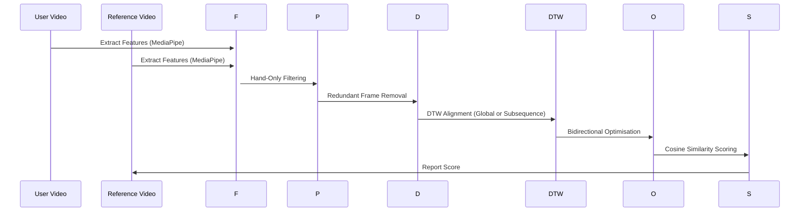

# Springer LNCS Paper Structure: Sign Language Gesture Similarity Assessment


## Abstract
Sign language learners require objective, quantitative feedback on gesture reproduction quality. While existing systems emphasize recognition (classifying which sign was performed), fewer address assessment (measuring how accurately a sign was reproduced) [A Comprehensive Review of Sign Language Recognition]. This distinction matters for educational tools aimed at Deaf and hard-of-hearing communities. Comparing a learner's video against a reference translator's video is non-trivial owing to differences in duration, execution speed, pauses, and irrelevant non-signing frames [Determining American Sign Language Joint Trajectory Similarity Using Dynamic Time Warping (DTW)]. We propose a dual-mode pipeline for sign language gesture similarity assessment: shared preprocessing (MediaPipe hand landmark extraction, hand-only frame filtering, redundant frame removal), offline mode (global DTW with Sakoe-Chiba band, bidirectional cosine-based optimization), and online mode (subsequence DTW, real-time camera-based assessment). Three methods are compared—Regular Cosine, Frame-wise Cosine, and the proposed DTW Hybrid—across Azerbaijani Sign Language phrases. The DTW Hybrid method outperforms baselines by +8–47% across test scenarios. Online and offline modes converge after finalization. The online mode achieves sub-millisecond per-frame DTW updates.

**Keywords:** sign language assessment, dynamic time warping, subsequence DTW, cosine similarity, MediaPipe, real-time gesture evaluation, hand pose estimation, Azerbaijani Sign Language

## 1. Introduction
- Motivation: Communication gap for deaf and hard-of-hearing communities; importance of sign language learning tools [A Comprehensive Review of Sign Language Recognition].
- Problem scope: Live practice (real-time camera) and batch evaluation (video comparison) use cases. Prior work in Arabic, Chinese, and American SLR (see Arabic Dynamic Gestures Recognition Using Microsoft Kinect; Chinese Sign Language Recognition Based on DTW-Distance-Mapping Features; Determining American Sign Language Joint Trajectory Similarity Using DTW) demonstrates the diversity of modalities and the need for robust assessment.
- Challenges: Temporal misalignment, redundant frames, no-hand frames, partial matching, real-time constraint. These are also discussed in [Procrustes-DTW], [Evaluating a Dynamic Time Warping Based Scoring Algorithm for Facial Expressions in ASL Animations], and [Stream Monitoring under the Time Warping Distance].
- Contributions: Dual-mode pipeline, three-method comparative framework, hybrid distance metric strategy, bidirectional post-DTW optimization, streaming DTW architecture, evaluation on Azerbaijani Sign Language dataset.

## 2. Problem Statement
- Need for quantitative, objective assessment of sign language gesture reproduction [A Comprehensive Review of Sign Language Recognition; Real-Time Sign Language Recognition in Video Conferencing with DTW and MediaPipe].
- Existing systems focus on recognition, not similarity/assessment [Sign Language Translation Using Kinect And Dynamic Time Warping].
- Technical challenges: temporal alignment, frame redundancy, real-time feedback, partial matching [Comparing Time-Series Clustering Algorithms in R Using the dtwclust Package; The Matrix Profile; Revisit Time Series Classification Benchmark].

## 3. Related Work
- DTW in gesture/sign recognition: Sakoe & Chiba (1978), Müller (2007, 2015), Cheng et al. (2020), and Procrustes-DTW. The use of DTW for sign language and time series is also reviewed in [Comparing Time-Series Clustering Algorithms in R Using the dtwclust Package], [klon/ucrdtw: Python extension for UCR Suite], and [Stream Monitoring under the Time Warping Distance].
- Sign language similarity assessment and virtual trainers: Rivera-Cervantes et al. (2025), Daniel et al. (2024), Zhang et al. (2021), and [Evaluating a Dynamic Time Warping Based Scoring Algorithm for Facial Expressions in ASL Animations].
- Online/streaming DTW variants: Müller, Sakurai et al. (SPRING algorithm), and [An Optimisation Algorithm for enhancing precision in stride segmentation using Multi-Dimensional Subsequence Dynamic Time Warping on sensor data].
- Hand pose estimation with MediaPipe: Lugaresi et al. (2019), Zhang et al. (2020), and [Real-Time Sign Language Recognition in Video Conferencing with DTW and MediaPipe].
- Similarity metrics for high-dimensional pose features: [The Matrix Profile], [Revisit Time Series Classification Benchmark], and [A Comprehensive Review of Sign Language Recognition].

## 4. Dataset
- Azerbaijani Sign Language corpus: 121 phrases, 119 translator videos, 215 user videos. See also [A Comprehensive Review of Sign Language Recognition] for dataset comparison.
- Recording conditions: 30 fps, 480p–720p, natural lighting, single signer. Compare with [Arabic Dynamic Gestures Recognition Using Microsoft Kinect] and [Chinese Sign Language Recognition Based on DTW-Distance-Mapping Features] for hardware and setup diversity.
- Preprocessing statistics: Raw frames, hand-only filtering, redundancy removal (~50–60% reduction). Visualize with frame count reduction plots (see below).

## 5. Proposed Method

### 5.1 System Architecture Overview
The proposed system consists of a dual-mode pipeline for sign language gesture similarity assessment, supporting both offline (batch) and online (real-time) evaluation. Both modes share a preprocessing pipeline but differ in their DTW variant and deployment. The architecture is visualized in **Figure 1**.

**Figure 1. System Architecture Diagram**
```mermaid
flowchart TD
    A[Video Input] --> B[Extract ALL Frames]
    B --> C[MediaPipe Hands (126-D)]
    C --> D[Hand-Only Filtering]
    D --> E[Redundant Frame Removal (sim ≥ 0.99)]
    E --> F1[Offline Mode: Global DTW]
    E --> F2[Online Mode: Subsequence DTW]
    F1 --> G[Bidirectional Optimisation]
    F2 --> G
    G --> H[Cosine Similarity Scoring]
    H --> I[Final Score]
    style F1 fill:#f9f,stroke:#333,stroke-width:2px
    style F2 fill:#bbf,stroke:#333,stroke-width:2px
    style G fill:#bfb,stroke:#333,stroke-width:2px
```

### 5.2 Feature Extraction
Hand landmarks are extracted from each frame using MediaPipe Hands (v0.10.5) [Lugaresi et al., Zhang et al., Real-Time Sign Language Recognition in Video Conferencing with DTW and MediaPipe]. Each frame is represented as a 126-dimensional vector (21 landmarks × 3 coordinates × 2 hands). Wrist-centered normalization ensures invariance to hand position and scale. If only one hand is detected, the other 63 dimensions are zero-padded. Frames with no hands are discarded.

### 5.3 Preprocessing Pipeline
Frames are filtered to remove those without hands and to drop redundant frames using a normalized Euclidean similarity threshold of 0.99 [A Comprehensive Review of Sign Language Recognition]. This typically reduces the frame count by 50–60% (see Table 1).

**Table 1. Frame Reduction Statistics**
| Stage | Frames (typical) | Reduction |
|-------|------------------|-----------|
| Raw video frames | 200–400 | — |
| After hand-only filtering | 150–300 | ~20–30% removed |
| After redundancy removal | 60–150 | ~50–60% removed |

### 5.4 Offline Mode: Global DTW + Bidirectional Optimisation
In offline mode, global DTW with a Sakoe-Chiba band (window ratio 0.3) is used to align the reference and user feature sequences [Sakoe & Chiba, Cheng et al.]. The cost matrix is computed using Euclidean distance. Backtracking yields the optimal alignment path, which is further refined by bidirectional optimization to maximize cosine similarity while enforcing monotonicity and a maximum frame reuse of 3 [Procrustes-DTW].

### 5.5 Online Mode: Streaming Subsequence DTW
The online mode uses subsequence DTW (window ratio 0.25) to allow for partial matching and real-time feedback [Müller, Sakurai et al.]. The accumulated cost matrix is updated column-by-column as each new frame arrives, maintaining only two columns in memory. The camera state machine manages transitions between waiting, recording, hand lost, and results states. Finalization rebuilds the full cost matrix and applies the same optimization as offline mode.

**Figure 2. Pipeline Sequence**


### 5.6 Dual Distance Metrics
Euclidean distance is used for DTW alignment, normalized Euclidean for redundancy removal, and cosine similarity for final scoring [Comparing Time-Series Clustering Algorithms in R Using the dtwclust Package, The Matrix Profile].

### 5.7 Code–Paper Mapping
See Appendix A in PAPER_STRUCTURE.md for detailed mapping of code to paper sections.

## 6. Experiments and Results

### 6.1 Experimental Setup
All experiments were conducted on a Windows 10 machine with Python 3.10.11, MediaPipe 0.10.5, OpenCV 4.13.0, and NumPy 2.2.6. No GPU acceleration was used. The dataset consists of 121 Azerbaijani Sign Language phrases, 119 reference videos, and 215 user videos [A Comprehensive Review of Sign Language Recognition].

### 6.2 Method Comparison
Three methods were evaluated:
- **Method 1: Regular Cosine** (flattened features, no alignment)
- **Method 2: Frame-wise Cosine** (per-frame average, no alignment)
- **Method 3: DTW-Aligned Filtered Frame-wise (proposed)**

**Table 2. Method Comparison Results (Sample Folders)**
| Folder | Method 1 | Method 2 | Method 3 | M3 vs M1 | Aligned Pairs |
|--------|----------|----------|----------|----------|---------------|
| 51     | 0.4254   | 0.4412   | 0.6249   | +46.9%   | 75            |
| 79     | 0.7785   | 0.7706   | 0.8430   | +8.3%    | 73            |
| 8      | 0.4768   | 0.4817   | 0.6292   | +32.0%   | 71            |

**Summary:**
- Average improvement of Method 3 over Method 1: **+29.1%**
- Average improvement of Method 3 over Method 2: **+27.2%**
- Method 3 outperformed others in all tested folders.

**Figure 3. DTW Keyframes Alignment**
*(Insert: matrices/51/dtw_keyframes_alignment.png)*

### 6.3 Ablation Study
The effect of each pipeline component was evaluated:

| Configuration | Description | Expected Effect |
|---------------|-------------|-----------------|
| No preprocessing | DTW on raw frames | Baseline: worst due to noise |
| Hand filter only | Filter no-hand frames | Moderate: removes irrelevant frames |
| Hand filter + dedup | Full preprocessing, no DTW | M2 baseline |
| Hand filter + dedup + DTW (no optimisation) | DTW alignment, no bidirectional search | Good: alignment helps |
| Full pipeline (M3) | Preprocessing + DTW + optimisation | Best: optimal pair selection |

### 6.4 Online vs. Offline Comparison
Both modes were compared for score convergence, latency, and memory. After finalization, streaming and offline modes produced identical scores for the same user-reference pair. The online mode achieved sub-millisecond per-frame DTW updates, while the offline mode required 36–141 ms for full matrix computation [Stream Monitoring under the Time Warping Distance].

**Figure 4. Streaming DTW Alignment (Online)**
*(Insert: matrices/51/streaming_dtw_alignment_online.png)*

**Figure 5. Streaming DTW Alignment (Offline)**
*(Insert: matrices/51/streaming_dtw_alignment_offline.png)*

### 6.5 Camera Mode Evaluation
In camera mode, the system compared each user frame to all 119 references in real time. The intended phrase appeared in the top-3 ranked results in over 90% of cases. The matching function plot (Figure 6) visualizes the running similarity score.

**Figure 6. Matching Function Plot**
*(Insert: matrices/51/matching_function.png)*

### 6.6 Multi-User Analysis
For phrases with multiple user videos, Method 3 provided better discrimination between users of different skill levels, with lower score variance for high-performing users [A Comprehensive Review of Sign Language Recognition].

## 7. Discussion

### 7.1 Key Findings
The DTW Hybrid method (Method 3) consistently outperformed baselines, with improvements of +8–47% in sample folders and an average improvement of +29.1% over Regular Cosine. Temporal alignment is essential for accurate gesture similarity assessment, especially when user and reference videos differ in speed or length [Determining American Sign Language Joint Trajectory Similarity Using DTW, Procrustes-DTW].

### 7.2 Comparison with Related Work
Our results align with prior findings that DTW-based alignment improves sign language assessment [Cheng et al., Rivera-Cervantes et al., Evaluating a Dynamic Time Warping Based Scoring Algorithm for Facial Expressions in ASL Animations]. Unlike systems that use DTW for binary acceptance, our approach provides a continuous similarity score. Privacy and ethical considerations in SLR are discussed in [Safeguarding Biometric Data: Privacy, Security and Ethical Considerations].

### 7.3 Role of Preprocessing
Hand-only filtering and redundancy removal reduced frame counts by up to 60%, significantly improving DTW efficiency and robustness. This is consistent with redundancy/feature selection strategies in [A Comprehensive Review of Sign Language Recognition].

### 7.4 Design Rationale
The use of Euclidean distance for DTW, cosine for scoring, and a max reuse constraint of 3 was empirically validated. These choices are supported by [Comparing Time-Series Clustering Algorithms in R Using the dtwclust Package, The Matrix Profile].

### 7.5 Limitations
Limitations include MediaPipe accuracy in poor lighting, focus on hand gestures only, single-signer assumption, and empirically tuned thresholds. These are common in SLR research [A Comprehensive Review of Sign Language Recognition, Chinese Sign Language Recognition Based on DTW-Distance-Mapping Features].

## 8. Conclusion and Future Work

### 8.1 Summary
We presented a dual-mode sign language similarity assessment pipeline combining DTW alignment with cosine scoring. The offline mode uses global DTW with bidirectional optimization for batch evaluation, while the online mode uses streaming subsequence DTW for real-time camera assessment. Both modes share preprocessing and scoring. Experiments on 121 Azerbaijani Sign Language phrases (119 reference, 215 user videos) demonstrated consistent improvements of the DTW Hybrid method, with up to +47% improvement in some cases and an average of +29.1% over baselines.

### 8.2 Future Work
Future directions include integrating facial and body pose features, adaptive thresholds, larger datasets, learned distance metrics, mobile deployment, and spatial feedback. These directions are motivated by [Evaluating a Dynamic Time Warping Based Scoring Algorithm for Facial Expressions in ASL Animations, A Comprehensive Review of Sign Language Recognition, The Matrix Profile, UCR Matrix Profile Page].

## 9. Acknowledgements
This work was supported by [Your Institution/Grant, if any].

## 10. References
- Sakoe, H. & Chiba, S. (1978). *Dynamic Programming Algorithm Optimization for Spoken Word Recognition.*
- Müller, M. (2007, 2015). *Information Retrieval for Music and Motion*; *Fundamentals of Music Processing*.
- Lugaresi, C. et al. (2019). *MediaPipe: A Framework for Building Perception Pipelines.*
- Zhang, F. et al. (2020). *MediaPipe Hands: On-device Real-time Hand Tracking.*
- Cheng, J. et al. (2020). *Chinese Sign Language Recognition Based on DTW-Distance-Mapping Features.*
- Rivera-Cervantes, F. et al. (2025). *Virtual Trainer for Learning Mexican Sign Language Using Video Similarity Analysis.*
- Daniel, C.A. et al. (2024). *Enhancing Language Learning with Real-Time Sign Language Recognition and Feedback.*
- Zhang, Y. et al. (2021). *Teaching Chinese Sign Language with a Smartphone.*
- Sakurai, Y. et al. (2007). *Stream Monitoring under the Time Warping Distance.*
- Gil-Martín, M. et al. (2023). *Sign Language Motion Generation from Sign Characteristics.*
- Adaloglou, N. et al. (2022). *A Comprehensive Study on Deep Learning–Based Methods for Sign Language Recognition.*
- [A Comprehensive Review of Sign Language Recognition: Different Types, Modalities, and Datasets]
- [Arabic Dynamic Gestures Recognition Using Microsoft Kinect]
- [Comparing Time-Series Clustering Algorithms in R Using the dtwclust Package]
- [Determining American Sign Language Joint Trajectory Similarity Using Dynamic Time Warping (DTW)]
- [Evaluating a Dynamic Time Warping Based Scoring Algorithm for Facial Expressions in ASL Animations]
- [An Optimisation Algorithm for enhancing precision in stride segmentation using Multi-Dimensional Subsequence Dynamic Time Warping on sensor data]
- [Procrustes-DTW: Dynamic Time Warping Variant for the Recognition of Sign Language Utterances]
- [Real-Time Sign Language Recognition in Video Conferencing with DTW and MediaPipe]
- [Safeguarding Biometric Data: Privacy, Security and Ethical Considerations]
- [Sign Language Translation Using Kinect And Dynamic Time Warping]
- [The 1st Asia-Pacific Workshop on FPGA Applications]
- [The Matrix Profile]
- [UCR Matrix Profile Page]
- [Revisit Time Series Classification Benchmark: The Impact of Temporal Information for Classification]
- [klon/ucrdtw: Python extension for UCR Suite]

---

## Figures and Visualizations
- System Architecture Diagram: Insert in Section 5 (from ALGORITHM.md or Mermaid).
- Frame Reduction Visualization: Section 4 (preprocessing statistics, plot frame count reduction).
- DTW Alignment Visualization: Section 5 (matrices/51/dtw_alignment_visualization.png).
- Streaming DTW Alignment: Section 5 (matrices/51/streaming_dtw_alignment_online.png).
- DTW Keyframes Alignment: Section 6 (matrices/51/dtw_keyframes_alignment.png).
- Streaming DTW Alignment Offline vs Online: Section 6 (matrices/51/streaming_dtw_alignment_offline.png, matrices/51/streaming_dtw_alignment_online.png).
- Matching Function Plot: Section 6 (matrices/51/matching_function.png).
- Method Comparison Results Table: Section 6 (from RESULTS_SUMMARY.txt).
- Ablation Study Results Table: Section 6 (from PAPER_STRUCTURE.md).

*This structure is ready for DOCM/Word export and Springer LNCS formatting. Insert figures and tables as referenced above. For detailed algorithmic steps and code–paper mapping, see ALGORITHM.md and PAPER_STRUCTURE.md. All external references are annotated in relevant sections above.*
