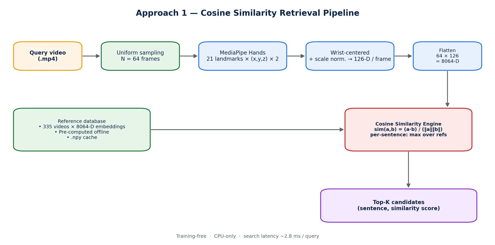
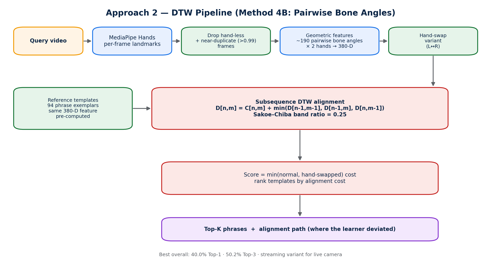
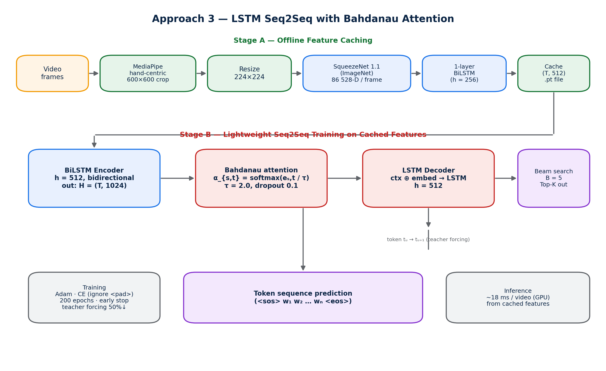
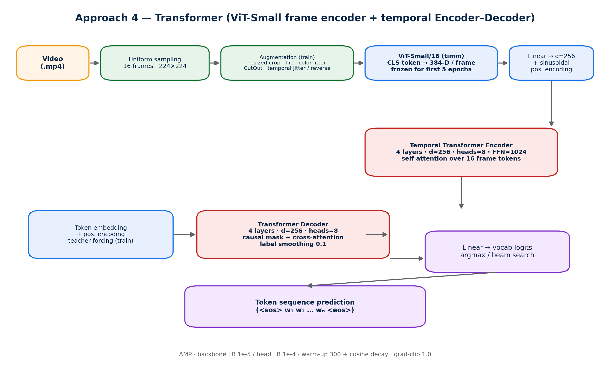

# Appendices A–F

This document contains the six appendices of the final report. Cross-references use repository-relative paths from this file's location ([diagrams/](.)).

---

## Appendix A — Requirements Traceability Matrix

The matrix below traces each high-level requirement (taken from §2.1 / §5.3 of [final_report.md](../final_report.md)) to the implementing component(s) and the validation evidence. "Status" reflects what is demonstrably delivered in the current `main` branch.

| # | Requirement | Type | Source | Implementing Component(s) | Validation Evidence | Status |
|---|---|---|---|---|---|---|
| R1 | Recognise sentence-level AzSL from a recorded video | Functional | §2.1 | All four pipelines: [cosine/](../cosine/), [DTW/](../DTW/), [lstm/](../lstm/), [Transformer/](../Transformer/) | Top-1 / Top-3 / Top-5 in [results.md](../results.md) | Met |
| R2 | Return ranked Top-K candidates with continuous scores | Functional | §2.1, §5.2 | [cosine/scripts/top3_accuracy.py](../cosine/scripts/top3_accuracy.py), [DTW/evaluate_recognition.py](../DTW/evaluate_recognition.py), beam search in [lstm/](../lstm/) and [Transformer/predict.py](../Transformer/predict.py) | Top-K columns in §B.1 | Met |
| R3 | Run on commodity CPU without mandatory GPU | Non-functional | §2.1, §5.3 | Cosine + DTW pipelines (CPU-only by design) | Latency profile §B.4: cosine 2.7 s, DTW 7.8 s on Intel i7 | Met |
| R4 | Real-time recognition from a webcam | Functional | §3.6 | [DTW/camera_dtw.py](../DTW/camera_dtw.py) (incremental column-by-column DTW) | Streaming mode demonstrated; algorithm in [DTW/ALGORITHM.md](../DTW/ALGORITHM.md) §5 | Met |
| R5 | Add a new phrase without retraining | Functional | §5.3 | Cosine + DTW templates; new entry = one new reference video | Procedure in §E.4 | Met |
| R6 | Provide graded, interpretable feedback (not binary) | Functional | §2.1, §5.3 | All pipelines emit scalar scores; DTW additionally returns alignment path | Score distributions in [cosine/outputs/figures/paper_figures/](../cosine/outputs/figures/paper_figures/) | Met |
| R7 | Indicate where the learner deviated from the reference | Functional | §2.1 | DTW alignment path → backtrack rule in [DTW/ALGORITHM.md](../DTW/ALGORITHM.md) §4.4 | Visualisation scripts in [DTW/visualize_dtw_*.py](../DTW/) | Met |
| R8 | Deterministic / reproducible runs | Non-functional | §5.2 | `seed = 44` (cosine, DTW, LSTM); `seed = 42` (Transformer split) | [cosine/scripts/config.py](../cosine/scripts/config.py), [DTW/config.py](../DTW/config.py), [lstm/config.py](../lstm/config.py), [Transformer/config/config.py](../Transformer/config/config.py) | Met |
| R9 | Comparable evaluation across pipelines | Non-functional | §4.1 | Shared CSV ([lstm/drive/sentences_all.csv](../lstm/drive/sentences_all.csv)) and shared video tree | Cross-pipeline table §B.1 | Met |
| R10 | Document the system for future researchers | Non-functional | §5.3 | [final_report.md](../final_report.md), [DTW/ALGORITHM.md](../DTW/ALGORITHM.md), [confrence.md](../confrence.md), [DTW/ITTA2026_paper.md](../DTW/ITTA2026_paper.md) | Documents are checked in | Met |
| R11 | Sentence-level transcription from neural model | Functional | proposal | [lstm/](../lstm/), [Transformer/](../Transformer/) | LSTM 16.0 % Top-1 on 407 videos; Transformer evaluation incomplete | Partially met |
| R12 | Full Transformer test-set evaluation | Functional | §5.4 | [Transformer/random_100_eval.py](../Transformer/random_100_eval.py) | Only 30-sample subset run; 6.7 % | Not met |
| R13 | LSTM evaluation on the complete cached set | Functional | §3.5 | [lstm/research_eval_seq2seq.py](../lstm/research_eval_seq2seq.py) | 93 of 500 videos skipped (missing caches) | Partially met |
| R14 | On-device / mobile inference | Non-functional | §5.6 | — | No mobile build exists | Not met |
| R15 | Learner-facing UI | Functional | §5.6 | — | System emits ranked candidates only | Not met |
| R16 | Multi-template DTW (3–5 templates per phrase) | Functional | §5.6, [DTW/PAPER_STRUCTURE.md](../DTW/PAPER_STRUCTURE.md) | — | Documented, not implemented | Not met |
| R17 | Non-manual features (face / pose) | Functional | §5.6 | — | All pipelines use hands only | Not met |
| R18 | Signer-disjoint evaluation | Non-functional | §5.6 | — | No held-out signer split | Not met |

**Coverage summary:** 10 of 18 requirements fully met, 2 partially met, 6 explicitly not met (and listed as future work in §5.6 of [final_report.md](../final_report.md)).

---

## Appendix B — Detailed Test Results or Calculations

All numbers are taken from [results.md](../results.md) and [cosine/outputs/figures/paper_figures/](../cosine/outputs/figures/paper_figures/) (`section4_stats.txt`, `accuracy_results.txt`, `accuracy_vs_n_results.txt`).

### B.1 Cross-pipeline accuracy (full final table)

| Method | Eval set (n) | Top-1 | Top-3 | Top-5 | Latency |
|---|---|---|---|---|---|
| Cosine (LOOCV) | 342 | 30.7 % | 45.0 % | 49.4 % | ~2.7 s CPU |
| DTW Method 6 (cos-cost) | 215 vs 94 refs | 33.95 % | 44.65 % | 50.23 % | ~7.8 s CPU |
| DTW Method 4D (bones+angles+len+d¹) | 215 vs 94 refs | 33.02 % | 49.30 % | 55.35 % | ~7.8 s CPU |
| **DTW Method 7 (angles + rel. lengths, paper best)** | 215 vs 94 refs | **40.00 %** | **50.23 %** | **56.28 %** | ~7.8 s CPU |
| DTW Method 7b (M7 + wrist) | 215 vs 94 refs | 40.47 % | 51.16 % | 55.81 % | ~7.8 s CPU |
| LSTM Seq2Seq (greedy) | 407 | 15.97 % | 25.55 % | 26.54 % | ~18 ms GPU |
| Transformer Seq2Seq (random subset) | 30 | 6.7 % | — | — | ~100–500 ms GPU |

> Splits and reference sets differ across pipelines; numbers are presented with their evaluation context to keep the comparison honest.

### B.2 Cosine pipeline — frame-count sensitivity

Source: [cosine/outputs/figures/paper_figures/accuracy_vs_n_results.txt](../cosine/outputs/figures/paper_figures/accuracy_vs_n_results.txt).

| N (frames) | Top-1 | Top-3 | Top-5 |
|---|---|---|---|
| 16 | 27.78 % | 39.47 % | 46.78 % |
| 32 | 31.58 % | 43.86 % | 49.71 % |
| **64** | **30.70 %** | **45.03 %** | **49.42 %** |
| 128 | 30.70 % | 45.03 % | 49.42 % |

Performance plateaus at N = 64; doubling to 128 yields no improvement.

### B.3 Cosine pipeline — signer-type stratification

| Split | n | Top-1 | Top-3 | Top-5 |
|---|---|---|---|---|
| All | 342 | 30.7 % | 45.0 % | 49.4 % |
| User videos | 218 | 34.4 % | 49.5 % | 53.2 % |
| Translator videos | 122 | 24.6 % | 37.7 % | 43.4 % |
| Unknown | 2 | 0.0 % | 0.0 % | 0.0 % |

### B.4 Latency profile (per query)

| Stage | Cosine | DTW M7 | LSTM Seq2Seq | Transformer |
|---|---|---|---|---|
| Frame read + sample | 667.8 ms | ≈ same as cosine | — (cached) | ~40 ms |
| Per-frame feature extraction | 2 036.2 ms (MediaPipe) | ~2.0 s (MediaPipe) | offline cached | 60–300 ms (ViT, 16 frames) |
| Feature build (geometric) | — | ~0.5 s | — | — |
| Search / decode | **2.8 ms** (342 vecs) | ~5.3 s (94 refs, full DTW) | 17.1 ms (greedy) | 20–150 ms (decoder) |
| **Total** | **2 706.8 ms** (CPU) | **~7.8 s** (CPU) | **~18 ms** (GPU) | **~100–500 ms** (GPU) |

Hardware: Intel i7 (13th Gen), 15.7 GB RAM, no GPU for cosine/DTW; CUDA 12.1 GPU for LSTM/Transformer.

### B.5 LSTM training trajectory

| Epoch | Train loss | Val loss |
|---|---|---|
| 1 | 3.726 | 2.835 |
| 10 | 1.963 | 2.167 |
| 20 | 0.768 | 1.864 |
| **31** | — | **1.7905 ← best** |
| 50 | 0.201 | 1.798 |
| 200 | 0.303 | 1.794 |

Train–val gap (0.30 vs 1.79) confirms data-bounded overfitting.

### B.6 LSTM per-class highlights (Top-1)

| Sentence | Top-1 |
|---|---|
| *axşam xeyir* (Good evening) | 80.95 % (17 / 21) |
| *siz ad nə ?* (What is your name?) | 78.05 % (32 / 41) |
| *mən yazmaq bilmir* (I cannot write) | 52.38 % (11 / 21) |

### B.7 Transformer training trajectory

| Epoch | Val loss |
|---|---|
| 1 | 42.15 |
| 5 | 11.22 |
| 10 | 8.06 |
| 20 | 6.47 |
| **27** | **6.33 ← best** |
| 50 | 6.77 |
| 100 | 7.56 |
| 200 | 6.42 |

Best checkpoint: `Transformer/artifacts/checkpoints/best.pt` (epoch 27, val loss 6.33). NaN checkpoints at epochs 2, 99, 100 — small-data instability.

### B.8 DTW Method 7 vs Method 6 — error structure

McNemar's test on the same 215 user videos: χ² = 2.29, p ≈ 0.13 (not significant at this n). Off-diagonal cells of the 2×2 contingency table:

| | M6 correct | M6 wrong |
|---|---|---|
| **M7 correct** | (both correct) | **38** (M7-only) |
| **M7 wrong** | **25** (M6-only) | (both wrong) |

The two methods make largely distinct errors, suggesting score fusion as a future direction.

### B.9 Confusion matrices and figure references

Pre-rendered figures live in [cosine/outputs/figures/paper_figures/](../cosine/outputs/figures/paper_figures/):

| File | Content |
|---|---|
| `similarity_matrix.png` | 124 × 124 inter-sentence similarity heatmap |
| `per_sentence_accuracy.png` | per-class Top-1 bar chart |
| `topk_accuracy_bar.png` | Top-K accuracy summary |
| `score_distribution.png` | similarity-score distribution for correct vs incorrect retrievals |
| `frame_cosine_curve.png` | cosine vs frame index for representative pair |
| `feature_matrix_heatmap.png` | 64 × 126 feature matrix heatmap |
| `feature_matrix_diff_sentence.png` | feature-matrix delta between two sentences |
| `fig5_accuracy_vs_n.png` | accuracy vs N (16, 32, 64, 128) |

### B.10 Dataset statistics (cosine eval pool)

Source: [cosine/outputs/figures/paper_figures/section4_stats.txt](../cosine/outputs/figures/paper_figures/section4_stats.txt).

| Metric | Value |
|---|---|
| Total videos | 342 |
| Unique sentences | 124 |
| Translator videos | 122 |
| User videos | 218 |
| Unknown-type videos | 2 |
| Total duration | 2 222.6 s (37.0 min) |
| Avg duration / video | 6.50 s (σ = 1.86) |
| Median duration / video | 6.30 s |
| Min / Max duration | 2.34 / 12.93 s |
| Avg frames / video | 199.6 (σ = 58.5) |
| Min / Max frames | 71 / 397 |
| Videos / sentence (avg) | 2.8 |
| Videos / sentence (min – max) | 1 – 7 |

---

## Appendix C — Technical Drawings, Schematics, or Models

Architecture / pipeline diagrams for the four recognizers. Source files live in [diagrams/](.); the generator script is [diagrams/generate_architecture_diagrams.py](generate_architecture_diagrams.py).

**Figure C.1.** Cosine similarity retrieval pipeline.


**Figure C.2.** DTW pipeline (Method 4B / 7 — pairwise bone-angle features, subsequence DTW with Sakoe–Chiba band).


**Figure C.3.** LSTM Seq2Seq pipeline with Bahdanau attention (two-stage: offline SqueezeNet + BiLSTM cache → seq2seq training).


**Figure C.4.** Transformer pipeline (ViT-Small frame encoder + temporal Transformer encoder–decoder).


Additional system-level figures from the cosine paper draft are in [cosine/outputs/figures/paper_figures/](../cosine/outputs/figures/paper_figures/) — notably `fig1_system_architecture.png`, `fig2_mediapipe_hand.png`, `fig4_state_machine.png`, and `fig6_realtime_screenshot.png`.

---

## Appendix D — Supporting Design Documentation

The full supporting-documentation file lives at [diagrams/supporting_design_documentation.md](supporting_design_documentation.md) and contains:

1. **DTW algorithm reference** — feature extraction, cost matrix, subsequence DTW recursion, optimal-endpoint backtracking, Sakoe–Chiba band (`band_ratio = 0.25`), streaming column-by-column update, hand-swap handling, and final scoring (extracted from [DTW/ALGORITHM.md](../DTW/ALGORITHM.md)).
2. **Pipeline configuration tables** for all four pipelines, sourced verbatim from [cosine/scripts/config.py](../cosine/scripts/config.py), [DTW/config.py](../DTW/config.py), [lstm/config.py](../lstm/config.py), and [Transformer/config/config.py](../Transformer/config/config.py).
3. **Index of other supporting design documents** — algorithm specifications, paper drafts, READMEs, error analyses, the working notebook.

See that file for the full content; it is not duplicated here to keep the appendices file concise.

---

## Appendix E — User Instructions or Operating Procedures

### E.1 Prerequisites

- Python 3.8–3.11 inside a Conda environment.
- For neural training: CUDA 12.1-capable GPU. Cosine and DTW need only CPU.
- Install dependencies per pipeline: `pip install -r <pipeline>/requirements.txt` (see [lstm/requirements.txt](../lstm/requirements.txt), [Transformer/requirements.txt](../Transformer/requirements.txt)).
- Dataset: place AzSL videos under [lstm/drive/Video/Cam2/<idd>/](../lstm/drive/Video/Cam2/) and labels in [lstm/drive/sentences_all.csv](../lstm/drive/sentences_all.csv).

### E.2 Running each pipeline

| Pipeline | Entry point | Typical invocation |
|---|---|---|
| Cosine — single video query | [cosine/scripts/video_similarity.py](../cosine/scripts/video_similarity.py) | `python cosine/scripts/video_similarity.py --query <path>.mp4` |
| Cosine — leave-one-out eval | [cosine/scripts/top3_accuracy.py](../cosine/scripts/top3_accuracy.py) | `python cosine/scripts/top3_accuracy.py` |
| Cosine — webcam demo | [cosine/scripts/realtime_similarity.py](../cosine/scripts/realtime_similarity.py) | `python cosine/scripts/realtime_similarity.py` |
| DTW — full evaluation (Method 7) | [DTW/evaluate_recognition_method7_angles_rel_len.py](../DTW/evaluate_recognition_method7_angles_rel_len.py) | `python DTW/evaluate_recognition_method7_angles_rel_len.py` |
| DTW — webcam demo (streaming) | [DTW/camera_dtw.py](../DTW/camera_dtw.py) | `python DTW/camera_dtw.py` |
| LSTM — train | [lstm/main.py](../lstm/main.py) | `python lstm/main.py` |
| LSTM — inference | [lstm/inference.py](../lstm/inference.py) | `python lstm/inference.py --video <path>.mp4` |
| Transformer — train | [Transformer/train.py](../Transformer/train.py) | `python Transformer/train.py` |
| Transformer — predict | [Transformer/predict.py](../Transformer/predict.py) | `python Transformer/predict.py --video <path>.mp4` |

### E.3 Webcam (real-time DTW) workflow

1. Start [DTW/camera_dtw.py](../DTW/camera_dtw.py).
2. The webcam window opens; the FSM begins in `IDLE` (no hand detected).
3. Bring a hand into frame — the FSM transitions to `RECORDING` and frames are buffered.
4. Stop signing and remove your hand. After a 2.0 s `COOLDOWN` window the FSM enters `MATCHING`.
5. The system displays Top-3 candidate phrases with similarity scores. The FSM returns to `IDLE` for the next sentence.

The four-state FSM (`IDLE → RECORDING → COOLDOWN → MATCHING`) is described in §3.3 of [confrence.md](../confrence.md) and visualised in `cosine/outputs/figures/paper_figures/fig4_state_machine.png`.

### E.4 Adding a new phrase (cosine / DTW)

1. Record a single reference video for the new phrase.
2. Save it as `lstm/drive/Video/Cam2/<new_idd>/<filename>.mp4`.
3. Append a row to [lstm/drive/sentences_all.csv](../lstm/drive/sentences_all.csv): `<new_idd>;<sentence>;<sign-language gloss>`.
4. Pre-compute the embedding cache:
   - Cosine: `python cosine/scripts/extract_all_vectors.py`
   - DTW: rerun the DTW preprocessing script you intend to evaluate (e.g. [DTW/method7_angles_rel_len.py](../DTW/method7_angles_rel_len.py)).
5. The phrase is now part of the recognised vocabulary. **No retraining is required** — this is the operational benefit of the template-matching pipelines.

For LSTM and Transformer, adding a new phrase requires extending the vocabulary ([lstm/data/vocab.py](../lstm/data/vocab.py), [Transformer/artifacts/vocab.json](../Transformer/artifacts/vocab.json)) and retraining.

### E.5 Telegram bot interaction (dataset crowdsourcing)

The Telegram bot is the **dataset collection** front-end described in [confrence.md](../confrence.md) and the cited paper *Mustafazada et al., 2025*; it is **not** part of this codebase. Operating procedure (from the dataset paper):

1. The user opens the AzSL crowdsourcing bot in Telegram.
2. The bot prompts the user with a target sentence.
3. The user records and uploads a short signed video for that sentence.
4. The trimmed sentence-level video is added to the dataset and made available for download under the path layout consumed by this project (`<idd>/<filename>.mp4`).

If a future on-device recognizer needs Telegram integration, the bot wrapping logic must be implemented separately — there is no Telegram-bot module in this repository today.

### E.6 Reproducing the reported numbers

1. Set `seed = 44` in [cosine/scripts/config.py](../cosine/scripts/config.py), [DTW/config.py](../DTW/config.py), [lstm/config.py](../lstm/config.py); `seed = 42` for the Transformer split in [Transformer/config/config.py](../Transformer/config/config.py).
2. Cosine: `python cosine/scripts/top3_accuracy.py` → 30.70 / 45.03 / 49.42.
3. DTW M7: `python DTW/evaluate_recognition_method7_angles_rel_len.py` → 40.00 / 50.23 / 56.28.
4. LSTM: `python lstm/research_eval_seq2seq.py` → 15.97 / 25.55 / 26.54 (407 videos; 93 skipped due to missing caches).
5. Transformer: `python Transformer/random_100_eval.py` → 6.7 % exact-match on a random 30-sample subset.

---

## Appendix F — Additional Data or Supporting Information

### F.1 Master CSV — sample rows

File: [lstm/drive/sentences_all.csv](../lstm/drive/sentences_all.csv) (semicolon-separated; columns `idd; sentence; sign_language`).

```
1;Sizin adınız nədir ?;Siz ad nə ?
2;Mən Bakıda yaşayıram;Mən Bakı yaşamaq
3;Bakı Azərbaycanın paytaxtıdır;Bakı Azərbaycan paytaxt
…
```

The `sentence` column is the natural Azerbaijani sentence; `sign_language` is the signed gloss used as the seq2seq target. The CSV is consumed unchanged by all four pipelines.

### F.2 Video tree layout

```
lstm/drive/Video/Cam2/
├── 1/
│   ├── translator_video_*.mp4
│   └── user_video_*.mp4
├── 2/
│   └── …
├── …
└── 124/
    └── …
```

Each numeric folder corresponds to one `idd` in the master CSV. A folder may contain one translator video and zero-or-more user-contributed videos (mean 2.8, range 1–7; see §B.10).

### F.3 Feature-cache directory layout

| Cache | Location | Format | Producer |
|---|---|---|---|
| Cosine landmark matrices | [cosine/data/processed/matrices/](../cosine/data/processed/matrices/) | `.npy`, shape `(64, 126)` per video | [cosine/scripts/extract_all_vectors.py](../cosine/scripts/extract_all_vectors.py) |
| DTW per-method matrices | [DTW/matrices/](../DTW/matrices/) | `.npy`, shape `(T, D)` per video (D depends on method) | [DTW/method*_*.py](../DTW/) |
| LSTM Stage A features | [lstm/features_slr/](../lstm/features_slr/) | `.pt`, shape `(T, 512)` per video | [lstm/feature_extraction_slr/extract_features.py](../lstm/feature_extraction_slr/extract_features.py) |
| LSTM Telegram features | [lstm/features_telegram/](../lstm/features_telegram/) | `.pt`, shape `(T, 512)` per video | [lstm/feature_extraction_telegram/](../lstm/feature_extraction_telegram/) |
| Transformer vocabulary | [Transformer/artifacts/vocab.json](../Transformer/artifacts/vocab.json) | JSON | [Transformer/data/](../Transformer/data/) (built at first train) |
| Transformer checkpoints | [Transformer/artifacts/checkpoints/](../Transformer/artifacts/checkpoints/) | `.pt` (`best.pt`, top-3) | [Transformer/training/trainer.py](../Transformer/training/trainer.py) |

The folder name inside each cache mirrors the `idd` from the master CSV (or the sentence name in legacy DTW caches). [featuer_organizer.py](../featuer_organizer.py) is the helper that re-syncs cache layout with the dataset tree when caches are moved or rebuilt.

### F.4 GitHub Actions workflow configuration

**Status:** the repository does not currently contain a `.github/workflows/` directory; CI has not been configured. If/when CI is introduced, a minimal workflow that exercises the cosine pipeline (the only fully training-free path) would look like:

```yaml
# .github/workflows/ci.yml  (proposed; not yet committed)
name: ci
on: [push, pull_request]
jobs:
  cosine-eval:
    runs-on: ubuntu-latest
    steps:
      - uses: actions/checkout@v4
      - uses: actions/setup-python@v5
        with:
          python-version: '3.11'
      - run: pip install -r cosine/requirements.txt
      - run: python cosine/scripts/extract_all_vectors.py --smoke
      - run: python cosine/scripts/top3_accuracy.py --smoke
```

Adding a real CI workflow is recorded as a future task; the present repository is reproduced manually per Appendix §E.6.

### F.5 Software stack reference

| Layer | Package | Version |
|---|---|---|
| Runtime | Python | 3.8 – 3.11 |
| Deep learning | PyTorch | 2.5.1 |
| Deep learning | TorchVision | 0.20.1 |
| Vision Transformer | timm | ≥ 0.9 |
| Hand landmarks | MediaPipe | 0.10.5 |
| Video I/O | OpenCV | ≥ 4.8 |
| Video I/O (alt) | VidGear | 0.3.4 |
| Numerics | NumPy | 1.24 – 2.2.6 |
| Data | Pandas | 2.0 – 2.3.3 |
| Numerics | SciPy, scikit-learn | latest |
| Plots | Matplotlib | 3.10.7 |
| NLP metrics | NLTK | ≥ 3.8 |
| Logging | TensorBoard | ≥ 2.13 |
| GPU | CUDA | 12.1 |
| Pretrained | SqueezeNet 1.1 (ImageNet), ViT-Small/16 (ImageNet) | — |

### F.6 Hardware reference

| Role | Device |
|---|---|
| Cosine + DTW evaluation | Intel i7 (13th Gen), 15.7 GB RAM, no GPU |
| LSTM + Transformer training | NVIDIA CUDA 12.1-capable GPU |

Latency numbers in §B.4 were measured on the i7 machine; LSTM/Transformer GPU latencies are GPU-class dependent.
